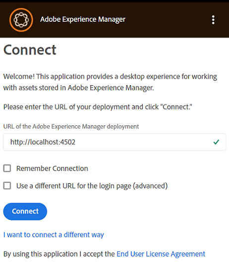
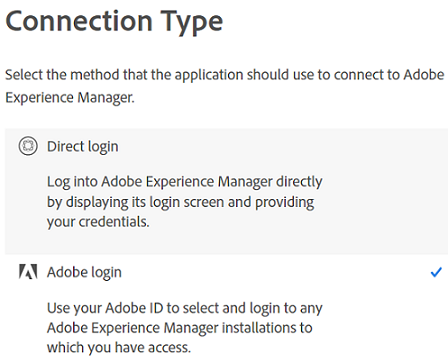
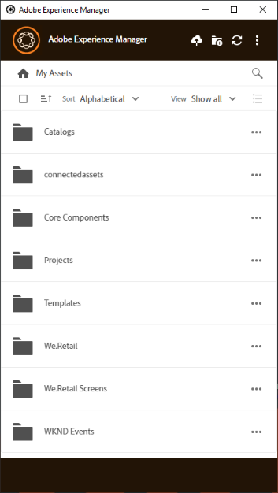

# Installera [!DNL Adobe Experience Manager] datorprogram {#install-app-v2}

Använda [!DNL Adobe Experience Manager] datorprogrammet, resurserna i [!DNL Experience Manager] är enkelt tillgängliga på din dator och kan användas i alla datorprogram. Resurserna kan förhandsgranskas, öppnas i datorprogram, visas i Mac Finder eller Utforskaren i Windows för montering i andra dokument och ändras lokalt - ändringarna sparas sedan i [!DNL Experience Manager] när du överför och en ny version skapas i databasen.

Tack vare en sådan integrering kan olika roller i organisationen:

* Hantera resurser centralt i [!DNL Experience Manager Assets].

* Få tillgång till materialet i alla datorprogram, inklusive program från tredje part och i Adobe Creative Cloud. När man gör det kan man enkelt följa de olika standarderna, inklusive branding.

Används [!DNL Experience Manager] datorprogram:

* Se till att [!DNL Experience Manager] versionen stöds av [!DNL Experience Manager] datorprogram. Se [systemkrav](release-notes.md).

* Hämta och installera programmet. Se [installera datorprogram](#install-v2) nedan.

* Testa anslutningen med några resurser. Se [söka efter resurser](using.md#browse-search-preview-assets).

## Systemkrav, krav och nedladdningslänkar {#tech-specs-v2}

Mer information finns i [[!DNL Experience Manager] versionsinformation för skrivbordsapp](release-notes.md).

## Uppgradera från en tidigare version {#upgrade-from-previous-version}

Om du använder v1.x av skrivbordsappen måste du förstå skillnaderna och likheterna mellan den tidigare och den senaste versionen av appen. Se [vad som är nytt i datorprogrammet](introduction.md#whats-new-v2) och [hur appen fungerar](release-notes.md#how-app-works).

>[!NOTE]
>
>Två versioner av skrivbordsappen kan inte finnas samtidigt på en dator. Avinstallera den andra versionen innan du installerar en version.

Följ dessa anvisningar om du vill uppgradera från en tidigare version av programmet:

1. Synkronisera alla resurser och överför dina ändringar innan du uppgraderar [!DNL Experience Manager]. Detta för att undvika att ändringar går förlorade när programmet avinstalleras.

1. Avinstallera den tidigare versionen av programmet. När du avinstallerar markerar du alternativet att rensa cachen.

1. Starta om datorn.

1. [Hämta](release-notes.md) och [installera](#install-v2) den senaste appen. Följ instruktionerna nedan.

## Installera {#install-v2}

Följ de här stegen för att installera skrivbordsprogrammet. Avinstallera alla befintliga Adobe [!DNL Experience Manager] desktop app v1.x innan du installerar den senaste appen. Mer information finns ovan.

1. Hämta det senaste installationsprogrammet från [versionsinformation](release-notes.md) sida.

1. Behåll URL:en och autentiseringsuppgifterna för [!DNL Experience Manager] användbar för driftsättning.

1. Om du uppgraderar från en annan version av programmet kan du läsa [uppgradera datorprogram](#upgrade-from-previous-version).

1. Hoppa över det här steget om du använder [!DNL Experience Manager] som [!DNL Cloud Service], [!DNL Experience Manager] 6.4.4 eller senare, eller [!DNL Experience Manager] 6.5.0 eller senare. Se till att [!DNL Experience Manager] installationen uppfyller kompatibilitetskraven som anges i [versionsinformation](release-notes.md). Hämta vid behov tillämpliga [kompatibilitetspaket](https://experience.adobe.com/#/downloads/content/software-distribution/en/aem.html?package=/content/software-distribution/en/details.html/content/dam/aem/public/adobe/packages/cq640/featurepack/adobe-asset-link-support) och installera det med [!DNL Experience Manager] Pakethanteraren som [!DNL Experience Manager] administratör. Information om hur du installerar ett paket finns i [Så här arbetar du med paket](https://experienceleague.adobe.com/docs/experience-manager-65/administering/contentmanagement/package-manager.html).

1. Kör installationsprogrammets binärfil och följ instruktionerna på skärmen.

1. I Windows kan installationsprogrammet uppmana dig att installera `Visual Studio C++ Redistributable 2015`. Installera den genom att följa instruktionerna på skärmen. Om installationen misslyckas installerar du den manuellt. Hämta installationsprogrammet från [här](https://www.microsoft.com/en-us/download/details.aspx?id=52685) och installera båda `vc_redist.x64.exe` och `vc_redist.x86.exe` filer. Kör om [!DNL Experience Manager] installationsprogram för skrivbordsprogram.

1. Starta om datorn enligt anvisningarna. Starta och konfigurera skrivbordsappen.

1. Ansluta appen till en [!DNL Experience Manager] klickar du på programikonen i fältet och startar programmet. Ange adressen till [!DNL Experience Manager] server i formatet `https://[aem_server]:[port]/`.

   Klicka **[!UICONTROL Connect]** och ange inloggningsuppgifterna.

   

   *Bild: Anslutningsskärmen till inmatningsserveradressen.*

   Välj **[!UICONTROL Remember Connection]** för att undvika att ange anslutningsinformation varje gång du loggar in på datorprogrammet.

   >[!CAUTION]
   >
   >Kontrollera att det inte finns några inledande eller avslutande blanksteg före eller efter adressen till [!DNL Experience Manager] server. Annars kan programmet inte ansluta till [!DNL Experience Manager] server.

1. [Valfritt] Klicka **[!UICONTROL I want to connect a different way]** och klicka **[!UICONTROL Adobe login]** om du vill logga in på Experience Manager Assets-servern med hjälp av Adobe Identity Management Service (IMS). Med IMS-inloggning kan skrivbordsappen utföra automatisk uppdatering av åtkomsttoken, så att användaren kan vara inloggad i upp till 14 dagar. Klicka **[!UICONTROL Direct login]** för att utföra standardinloggningen på [!DNL Experience Manager] server med användarens inloggningsuppgifter.

   

1. När anslutningen lyckades kan du visa listan över mappar och resurser som är tillgängliga i rotmappen i [!DNL Experience Manager] DAM. Du kan bläddra bland mapparna inifrån programmet.

   

   *Bild: Programmet visar DAM-innehållet efter inloggning*

1. ([!DNL Experience Manager] 6.5.1 eller senare) Om du använder datorprogrammet med [!DNL Experience Manager] 6.5.1 eller senare, uppgradera S3- eller Azure-anslutning till version 1.10.4 eller senare. Se [Azure-koppling](https://experienceleague.adobe.com/docs/experience-manager-65/deploying/deploying/data-store-config.html#azure-data-store) eller [S3-kontakt](https://experienceleague.adobe.com/docs/experience-manager-65/deploying/deploying/data-store-config.html#amazon-s-data-store).

   Om du är Adobe Managed Services-kund (AMS) kontaktar du Adobe kundsupport.

## Ange inställningar {#set-preferences}

Om du vill ändra inställningarna klickar du på  och **[!UICONTROL Preference]** . I **[!UICONTROL Preferences]** ändrar du värdena för följande:

* [!UICONTROL Launch application on login].

* [!UICONTROL Show window when application starts].

* **[!UICONTROL Cache Directory]**: Plats för appens lokala cache (den innehåller de lokalt hämtade resurserna).

* **[!UICONTROL Network Drive Letter]**: Den enhetsbeteckning som används för att mappa till [!DNL Experience Manager] DAM. Ändra inte detta om du inte är säker. Appen kan mappas till valfri enhetsbeteckning i Windows. Om två användare placerar resurser från olika enhetsbokstäver kan de inte se de resurser som placerats ut av varandra. Resursernas sökväg ändras. Resurserna förblir placerade i den binära filen (till exempel INDD) och tas inte bort. Appen visar alla tillgängliga enhetsbeteckningar och som standard använder den senast tillgängliga bokstaven som vanligtvis är `Z`.

* **[!UICONTROL Maximum Cache Size]**: Tillåten cache på hårddisken i GB som används för att lagra lokalt hämtade resurser.

* **[!UICONTROL Current cache size]**: Lagringsstorlek för lokalt hämtade resurser. Informationen visas först när resurserna har hämtats med appen.

* **[!UICONTROL Automatically download linked assets]**: Resurserna som placeras i de Creative Cloud-program som stöds hämtas automatiskt om du hämtar originalfilen.

* **[!UICONTROL Maximum number of downloads]**:  Byt med försiktighet. När du hämtar resurser för första gången (via Visa, Öppna, Redigera, Hämta eller liknande) hämtas resurserna endast om gruppen innehåller mindre än det här antalet. Standardvärdet är 50. Ändra inte om du är osäker. Om du ökar värdet kan det leda till längre väntetider och om du minskar värdet kanske du inte kan hämta nödvändiga resurser eller mappar på en gång.

* **[!UICONTROL Use legacy conventions when creating nodes for assets and folders]**:  Byt med försiktighet. Med den här inställningen kan appen emulera v1.10-appbeteendet när mappar överförs. I v1.10 gäller de nodnamn som skapas i databasen mellanslag och skiftlägen för de mappnamn som användaren anger. I v2.1 i programmet konverteras emellertid de extra mellanrummen i mappnamnen till streck. Överför till exempel `New Folder` eller `new   folder` skapar samma nod i databasen om alternativet inte är markerat och standardbeteendet i v2.1 behålls. Om det här alternativet är markerat skapas olika noder i databasen för de två mapparna ovan, och de matchar beteendet för v1.10-appen.

  Standardbeteendet för v2.1 fortsätter att vara detsamma, d.v.s. ersätter flera mellanslag i mappnamn med bindestreck i databasens nodnamn och konverterar till gemena nodnamn.

* **[!UICONTROL Upload Acceleration]**:  Byt med försiktighet. När du överför resurser kan programmet använda samtidiga överföringar för att förbättra överföringshastigheten. Du kan öka samtidigheten för överföringen genom att flytta reglaget åt höger. Skjutreglaget längst till vänster betyder ingen samtidighet (enkeltrådad överföring), mittpositionen motsvarar 10 samtidiga trådar och maxgränsen längst till höger motsvarar 20 samtidiga trådar. En högre samtidighetsgräns är mer resurskrävande.

Om du vill uppdatera inställningarna som inte är tillgängliga loggar du ut från [!DNL Experience Manager] och sedan uppdatera. När du har uppdaterat inställningarna klickar du på .


*Bild: Inställningar för skrivbordsprogram.*

### Stöd för proxy {#proxy-support}

[!DNL Experience Manager] datorprogrammet använder systemets fördefinierade proxy för att ansluta till Internet via HTTPS. Appen kan bara ansluta med en nätverksproxy som inte kräver extra autentisering.

Om du konfigurerar eller ändrar proxyserverinställningarna för Windows (Internetalternativ > LAN-inställningar) startar du om [!DNL Experience Manager] för att ändringarna ska börja gälla. Proxykonfigurationen används när du startar skrivbordsprogrammet. Stäng och starta om programmet för att ändringarna ska börja gälla.

Om din proxy kräver autentisering kan IT-teamet tillåta [!DNL Experience Manager Assets] URL:en i proxyserverinställningarna så att programtrafiken kan passera igenom.

## Avinstallera appen {#uninstall-the-app}

Så här avinstallerar du programmet i Windows:

1. Överför alla ändringar till [!DNL Experience Manager] för att undvika att förlora redigeringar. Se [Redigera resurser och överföra uppdaterade resurser till [!DNL Experience Manager]](using.md#edit-assets-upload-updated-assets). Logga ut och [!UICONTROL Exit] appen.

1. Ta bort appen när du tar bort andra operativsystemsprogram. Avinstallera det från Lägg till och ta bort program i Windows.

1. Markera kryssrutan om du vill ta bort cachen och loggarna.

   

1. Följ instruktionerna på skärmen. Starta om datorn när du är klar.

Så här avinstallerar du programmet på Mac:

1. Överför alla ändringar till [!DNL Experience Manager] för att undvika att förlora redigeringar. Se [Redigera resurser och överföra uppdaterade resurser till [!DNL Experience Manager]](using.md#edit-assets-upload-updated-assets). Logga ut och [!UICONTROL Exit] appen.

1. Ta bort `Adobe Experience Manager Desktop.app` från `/Applications`.

Du kan även rensa interna programcacheminnen på Mac och avinstallera programmet genom att köra följande kommando i terminalen:

```shell
/Applications/Adobe Experience Manager Desktop/Contents/Resources/uninstall-osx/uninstall.sh
```
