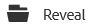
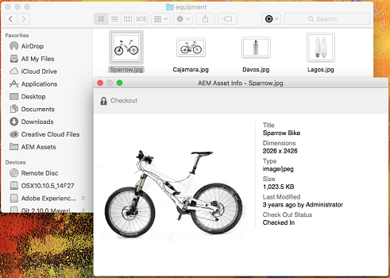
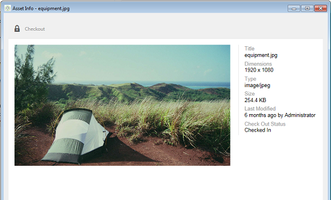
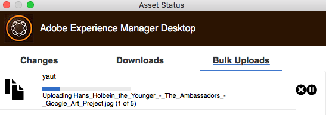

# Använd [!DNL Experience Manager] datorprogram v1.10 {#use-aem-desktop-app-v1x}

Med hjälp av appen kan resurserna i [!DNL Experience Manager] är lättillgängliga på din lokala dator och kan användas i alla skrivbordsprogram. Resurserna kan enkelt visas i Mac Finder eller Utforskaren i Windows, öppnas i skrivbordsprogram och ändras lokalt - ändringarna sparas sedan i [!DNL Experience Manager] med en ny version som skapats i databasen.

Tack vare en sådan integrering kan olika roller i organisationen hantera mediefilerna centralt i Assets och få tillgång till dem i Creative Cloud och andra program, samtidigt som det är enkelt att följa de olika standarderna, inklusive branding.

De viktigaste uppgifterna du utför med [!DNL Experience Manager] datorprogram v1:

1. [Kommunicera med en [!DNL Experience Manager] server](#installandconnect)
1. [Öppna resurser direkt på skrivbordet](#openondesktop)
1. [Redigera och checka ut resurser från datorn](#workonassets)
1. [Överför resurser och mappar i grupp](#bulkupload)

Information om de olika rekommenderade åtgärderna finns i [bästa sättet att använda appen](best-practices-for-v1.md). Om du har problem med appen kan du läsa om hur du [felsöka [!DNL Experience Manager] desktop](troubleshoot-app-v1.md).

>[!NOTE]
>
>Datorprogrammet introducerades i [!DNL Experience Manager] 6.1 och anropades [!DNL Experience Manager Assets Companion App].

## [!DNL Experience Manager] pekpunkter i datorprogrammet i det kreativa arbetsflödet {#aem-desktop-app-touch-points-in-the-creative-workflow}

[!DNL Experience Manager] datorprogram, tillsammans med [!DNL Assets], integreras i ditt kreativa arbetsflöde och har följande kontaktytor.

![[!DNL Experience Manager] pekpunkter i datorprogrammet i det kreativa arbetsflödet](assets/aem_desktopapp_workflow.png)

[!DNL Experience Manager] pekpunkter i datorprogrammet i det kreativa arbetsflödet

## Installera och anslut appen till [!DNL Experience Manager] server {#installandconnect}

Innan du kan börja skapa eller redigera de kreativa resurserna måste du ansluta datorprogrammet med [!DNL Assets] server för att hämta och överföra resurser i databasen. Utför följande uppgifter:

1. [Installera appen](#installapp).
1. [Ange dina inställningar](#inapppref) och anslutningsinformation.
1. [Ansluta till en [!DNL Experience Manager] server](#connect) och montera resurskatalogen som lokal enhet.
1. [Aktivera skrivbordsåtgärder](#desktopactions) på [!DNL Experience Manager] server.

[!DNL Experience Manager] skrivbordsappen använder en HTTPS-anslutning för att ansluta till [!DNL Experience Manager] för att överföra dina resurser på ett säkert och tillförlitligt sätt.

>[!NOTE]
>
>Om du behöver hjälp från din [!DNL Experience Manager] administratör eller systemadministratör.

### Installera programmet {#installapp}

Används [!DNL Experience Manager] datorprogram, se till att [!DNL Experience Manager] serverversionen stöds av programmet. Hämta lämplig installationsfil (binär) för ditt operativsystem (Mac eller Windows) och installera programmet.

Det kan vara nödvändigt att göra en detaljerad konfiguration beroende på ditt nätverk och dina systeminställningar. Se [Installera och konfigurera [!DNL Experience Manager] datorprogram](install-configure-app-v1.md) för mer information.

1. Gå till [[!DNL Experience Manager] nedladdningssida för datorprogram v1.10](/help/using/release-notes-of-v1.md) och ladda ned en binärfil för ditt operativsystem.
1. Starta den hämtade installationsfilen och följ instruktionerna på skärmen för att installera programmet.

   >[!NOTE]
   >
   >Endast en instans av [!DNL Experience Manager] kan installeras och vara aktivt i taget.

### Förstå alternativen och inställningarna i appen {#inapppref}

Programmet tillåter inställningar för att ansluta och koppla från [!DNL Experience Manager] servrar, visa status för överföringar, hantera lokal cache och så vidare. Standardinställningarna fungerar för en typisk användare av programmet. Du kan ändra inställningarna för att få ut mer av programmet och få ut mer av integreringen med [!DNL Experience Manager] server. De olika inställningarna beskrivs nedan i detalj.

**Utforska resurser** Öppna den lokala enheten som [!DNL Assets] databasen är monterad. Du kan med andra ord utforska de resurser som nu finns tillgängliga på din lokala dator.

**Visa tillgångsstatus** När ändrade resurser överförs eller nya resurser läggs till i [!DNL Assets] -databasen överför programmet resurserna i bakgrunden. Bakgrundsuppladdningen möjliggör smidiga åtgärder utan att du behöver vänta tills överföringen är klar, särskilt för stora resurser. Du kan spara ändringarna lokalt och glömma det. Det tar ett tag att skicka resurserna till servern, beroende på den tillgängliga bandbredden. Du kan kontrollera överföringsstatus tillsammans med mer grundläggande information.

**Alternativ** Klicka på alternativen i skrivbordsappen för att komma åt inställningarna och starta programmet när datorn startas; för att ansluta till [!DNL Experience Manager] server när appen startas, och ändra den lokala enhetsbokstaven där [!DNL Assets] är tillgängligt efter montering.

**Avancerat > Hantera cache** Du kan styra hur mycket diskutrymme som finns tillgängligt för lokal cachelagring. Artefakter från [!DNL Assets] servern cachelagras lokalt för en smidigare upplevelse. Du kan ändra standardinställningarna så att de passar dina behov. Du kan även rensa cachen för att hämta alla resurser på nytt. När du rensar cachen bevaras ändringarna som inte sparats. Alla resurser som inte är incheckade [!DNL Experience Manager] servern bevaras och tas inte bort.

### Ansluta till en [!DNL Experience Manager] server {#connect}

Appen har stöd för proxykonfiguration i Mac och Windows. Konfigurationen läses när appen startas. Om du ändrar proxyinställningarna startar du om programmet så att ändringarna börjar gälla.

>[!NOTE]
>
>Om du ändrar proxyinställningarna startar du om programmet så att ändringarna börjar gälla. Annars fortsätter programmet att använda den tidigare konfigurerade proxyservern.

1. Starta [!DNL Experience Manager] datorprogram. Så här mappar du [!DNL Experience Manager] -instans med appen, ange [!DNL Experience Manager] server i formatet `https://[aem-server-url]:[port]`.

   ![Autentisera på Mac och tillhandahåll [!DNL Experience Manager] server-URL](assets/aem_desktop_app_server_url.png)

1. Ange användarnamn och lösenord för instansen på inloggningsskärmen. Ange ett alternativ [!DNL Experience Manager] -instans, markera **[!UICONTROL Alternate Login URL]** alternativ.

   ![Ange [!DNL Experience Manager] serverautentiseringsuppgifter på inloggningsskärmen på [!DNL Experience Manager] datorprogram](assets/login_screen_v1.png)

### Aktivera skrivbordsåtgärder i [!DNL Experience Manager] webbgränssnitt {#desktopactions}

I Assets-användargränssnittet kan du utforska resursplatserna eller checka ut och öppna resursen för redigering i ditt skrivbordsprogram. Dessa alternativ kallas skrivbordsåtgärder och är inte aktiverade som standard. Följ de här stegen för att aktivera den.

1. Klicka/tryck på ikonen Användare i det övre högra hörnet av verktygsfältet i gränssnittet Resurser.
1. Klicka **[!UICONTROL My Preferences]** för att visa **[!UICONTROL Preferences]** -dialogrutan.

   ![[!DNL Experience Manager] gränssnitt med användarinställningar](assets/aem_ui_user_preferences.png)

1. I [!UICONTROL User Preferences] dialogruta, välja **[!UICONTROL Show Desktop Actions For Assets]** och sedan klicka **[!UICONTROL Accept]**.

   ![Kontrollera [!UICONTROL Show Desktop Actions For Assets] för att aktivera skrivbordsåtgärder](assets/enable_desktop_actions.png)

   *Bild: Kontrollera [!UICONTROL Show Desktop Actions For Assets] för att aktivera skrivbordsåtgärder.*

## Få åtkomst till och öppna resurser på datorn {#openondesktop}

När du klickar **Öppna** om du vill öppna en resurs på en lokal dator hämtar programmet resursen till dess interna cache. Programmet startar det inbyggda skrivbordsprogrammet som är associerat med filtypen för den hämtade resursen.

På Mac väljer du **Öppna** på snabbmenyn för att öppna en resurs via [!DNL Experience Manager] datorprogram. I Windows väljer du Öppna på webben på snabbmenyn för att öppna resursen. I fönstret Resursstatus klickar/trycker du  för att öppna resursen.

För Adobe InDesign-filer (INDD) väljer du **[!UICONTROL Open]** på snabbmenyn. När du klickar på det här alternativet hämtar appen de länkade resurserna till ditt lokala filsystem och öppnar sedan INDD-filen i Adobe InDesign. Den här metoden ser till att nödvändiga resurser är lokalt tillgängliga när du redigerar INDD-filen.

![Alternativ på snabbmenyn för att öppna och öppna resurser med [!DNL Experience Manager] datorprogram](assets/aem_desktopapp_mac_context_menu.png)

*Bild: Alternativ på snabbmenyn för att öppna och öppna resurser med [!DNL Experience Manager] datorprogram.*

>[!NOTE]
>
>I Windows [standardinställning för Windows 7](https://support.microsoft.com/en-us/kb/2668751) förhindrar [!DNL Experience Manager] från att hantera resurser som är större än 50 MB.

<!-- TBD: The above note is for Windows 7 which is not supported by the app anymore. Remove it later.
-->

>[!NOTE]
>
>Adobe rekommenderar att du går till Visningsalternativ i Finder på Mac och inaktiverar alternativen **Visa artikelinformation**, **Visa förhandsgranskning av objekt** och **Visa kolumn för förhandsgranskning** för monterad [!DNL Assets] mapp. Det förbättrar prestandan.

### Fler alternativ i [!DNL Experience Manager] gränssnitt {#additional-options-in-aem-assets}

När du har mappat [!DNL Assets] databas till din lokala enhet kan du aktivera ytterligare ikoner och funktionen Mappöverföring visas för mappade resurser och mappar.

1. Öppna [!DNL Assets] för pekaren över en mapp eller en resurs för att visa skrivbordsåtgärder som snabbåtgärder i kortvyn.

   

   *Bild: I resursgränssnittet öppnar du snabbåtgärdsmenyn för att se skrivbordsåtgärder.*

   Dessa skrivbordsåtgärder är även tillgängliga när du klickar på **Skrivbordsåtgärder** i verktygsfältet när du har valt resursen eller från verktygsfältet på resurssidan.

1. Om du vill öppna resursen i skrivbordsprogrammet som är associerat med det specifika filtillägget klickar du på **Öppna på skrivbordet** snabbåtgärd .

   Du kan också välja **Öppna** från **Skrivbordsåtgärder** i verktygsfältet.

Om du vill hitta en viss resurs i det lokala filsystemet klickar du på **Visa** snabbåtgärd . Du kan också välja **Visa** från **Skrivbordsåtgärder** i verktygsfältet.

## Förstå tillgångsstatusarna {#understand-the-asset-statuses}

|  | Appen är ansluten till servern och alla resurser synkroniseras. |
--- |--- |
|  | Appen startas men är inte ansluten till servern. Vissa resurser kanske väntar på synkronisering. |
|  | Resurserna synkroniseras. Filerna överförs eller hämtas. Du kan se exakta statusvärden och pausa överföringar från fönstret Resursstatus. |
|  | Programmet försöker återansluta. Nätverksproblemen kan leda till att den kopplas från. |

## Arbeta med dina resurser {#workonassets}

### Checka ut resurser från [!DNL Experience Manager] webbgränssnitt {#check-out-assets-from-the-aem-web-interface}

[!DNL Assets] Med kan du checka ut resurser för redigering och checka in dem igen när du har gjort ändringarna. När du har checkat ut en resurs kan bara du redigera, kommentera, publicera, flytta eller ta bort resursen. När du checkar ut en resurs låses resursen och andra användare hindras från att utföra någon av dessa åtgärder. Om du vill kunna checka ut/in resurser måste du ha skrivbehörighet för dem.

Det finns två sätt att checka ut resurser från [!DNL Experience Manager] webbgränssnitt. Mer information om den första metoden finns i [checka in och checka ut filer från Assets UI](https://experienceleague.adobe.com/docs/experience-manager-65/assets/managing/check-out-and-submit-assets.html). Följ de här stegen för de andra metoderna för att checka ut och öppna resursen när [!DNL Experience Manager] datorprogrammet är installerat.

1. Öppna [!DNL Assets] för pekaren över en mapp eller en resurs för att visa skrivbordsåtgärder som snabbåtgärder i kortvyn.

   

   Dessa skrivbordsåtgärder är också tillgängliga när du klickar/trycker på ikonen Skrivbordsåtgärder i verktygsfältet efter att du har valt resursen eller i verktygsfältet på resurssidan.

1. Klicka/tryck på snabbåtgärden Öppna på skrivbordet för att öppna resursen .

   Du kan också välja Öppna på menyn Skrivbordsåtgärder i verktygsfältet.

   >[!NOTE]
   >
   >När du redigerar en fil som just har öppnats och inte är utcheckad, kommer andra användare inte att veta att en resurs uppdateras av dig.

1. Om du vill öppna en resurs för redigering i ett Adobe Creative Cloud-program klickar/trycker du på snabbåtgärden Redigera skrivbord . Då checkas även resursen ut för redigering. När du är klar med redigeringen checkar du in resursen för att uppdatera ändringarna i [!DNL Assets].

   Du kan också välja Redigera på menyn Skrivbordsåtgärder i verktygsfältet.

1. Välj menyalternativet Öppna. De valda resurserna öppnas i förhandsgranskningsläge.
1. Om du vill redigera resurserna väljer du alternativet Redigera. Resurserna öppnas i redigeringsläge.

### Ta en titt på resurser från Finder i Mac OS {#check-out-assets-on-mac}

Med appen kan du checka ut resursfiler för att förhindra att andra användare ändrar de filer som du arbetar med.

1. På snabbmenyn för Mac väljer du alternativet Öppna AEM Assets-mapp för att öppna Finder.

   ![Alternativ på snabbmenyn för att öppna och öppna resurser med [!DNL Experience Manager] datorprogram](assets/aem_desktopapp_mac_context_menu.png)

   *Bild: Alternativ på snabbmenyn för att öppna och öppna resurser med [!DNL Experience Manager] datorprogram.*

1. Navigera till resursen som du vill checka ut.
1. Högerklicka på resursen och välj Mer resursinformation på snabbmenyn.
1. I dialogrutan Resursinformation klickar/trycker du på ikonen Checka ut för att checka ut resursen. Ikonen Checka ut växlar till ikonen för incheckning när du har klickat/tryckt på den.

   

1. Om du vill checka in resursen så att den är tillgänglig för andra användare klickar du på/trycker på incheckningsikonen i dialogrutan Resursinformation.

### Checka ut resurser i Windows {#check-out-assets-on-windows}

Med appen kan du checka ut resursfiler för att förhindra att andra användare ändrar de filer som du arbetar med.

1. Välj Utforska resurser på snabbmenyn för att öppna Utforskaren.
1. I Utforskaren navigerar du till platsen för resursen som du vill checka ut.
1. Högerklicka på resursen och välj Öppna på webben på snabbmenyn.
1. Klicka/tryck på ikonen Checka ut i dialogrutan Resursinformation. Ikonen Checka ut växlar till ikonen Checka in.

   

1. Granska resursen i Utforskaren. Låsikonen på resursen  visar att du har checkat ut resursen.

   >[!NOTE]
   >
   >Låsikonen kan visas efter en fördröjning. [!DNL Experience Manager] skrivbordsappen cachelagrar resurserna för snabb åtkomst så det kan ta en stund att uppdatera den låsta statusen.

1. Om du vill checka in resursen så att den är tillgänglig för andra användare klickar du på/trycker på ikonen för incheckning i dialogrutan **Resursinformation** -dialogrutan.

### Checka in en resurs med Finder eller Utforskaren och med webbgränssnittet {#check-in-an-asset-using-finder-or-explorer-and-using-web-interface}

När du är klar med redigeringen av resurserna sparar du resurserna i skrivbordsprogrammet. Välj **Mer resursinformation** och klicka på Checka in.

Resurserna överförs till [!DNL Experience Manager] server. Du kan också kontrollera överföringsstatus genom att välja **Visa resursstatus** från systemfältsikonen. Du kan även checka in en resurs från [!DNL Experience Manager] webbgränssnitt. Klicka på de utcheckade resurserna eller markera dem. Klicka på ikonen Checka in i verktygsfältet .

En resurs överförs till [!DNL Experience Manager] automatiskt när ändringarna sparas lokalt. Incheckningen gör tillgången tillgänglig för andra [!DNL Experience Manager] användare för redigering.

### Massöverföra resurser och mappar till [!DNL Experience Manager] server {#bulkupload}

Använda [!DNL Experience Manager] datorprogrammet kan du överföra en hel mapp med resurser från din lokala filkatalog till [!DNL Assets]. På så sätt överförs alla resurser i mappen gruppvis i stället för att behöva överföra dem en åt gången.

1. Klicka/tryck på i resursgränssnittet **Skapa** i verktygsfältet och väljer **Överför mapp** på menyn.
1. Bläddra till mappen som du vill överföra och markera den.
1. Klicka/tryck på OK. I dialogrutan Resursstatus visas status för överföringen.

   

   Se status för överföringen i fönstret Resursstatus

   >[!NOTE]
   >
   >Du kan pausa eller avbryta överföringen manuellt genom att klicka/trycka på lämplig ikon.

1. När mappen har överförts stänger du dialogrutan och navigerar till resursgränssnittet. Den överförda mappen visas i webbgränssnittet.

Adobe rekommenderar inte att du kopierar och klistrar in eller drar ett större antal filer eller kapslade mappar från det lokala filsystemet till nätverksresursområdet. Programmet kan inte styra överföringsprocessen på grund av tekniska begränsningar och prestandan är dålig.

Du kan också välja filer/mappar som du vill överföra till [!DNL Experience Manager] i Finder eller Utforskaren kopierar du dem till systemets Urklipp, navigerar till målmappen i nätverksresursområdet och från [!DNL Experience Manager] snabbmeny för skrivbordsprogram välja **Klistra in resurser**. Den här vägen [!DNL Experience Manager] skrivbordsappen börjar överföra de inklistrade resurserna som liknar **Överför mapp** finns i [!DNL Experience Manager] webbgränssnitt.

>[!MORELIKETHIS]
>
>* [Felsökning [!DNL Experience Manager] datorprogram](troubleshoot-app-v1.md)
