# Använd [!DNL Adobe Experience Manager] datorprogram {#use-aem-desktop-app-v2}

Använd [!DNL Adobe Experience Manager] datorprogram, så att du enkelt får tillgång till de digitala resurserna som lagras i [!DNL Adobe Experience Manager] DAM-databasen på din lokala dator och använd dessa resurser i alla skrivbordsprogram. Du kan öppna resurserna i skrivbordsprogrammen och redigera resurserna lokalt - överföra ändringarna tillbaka till [!DNL Experience Manager] med versionskontroll för att dela uppdateringarna med andra användare. Du kan också överföra nya filer och mapphierarkier till [!DNL Experience Manager], skapa mappar och ta bort resurser eller mappar från [!DNL Experience Manager] DAM.

Integreringen gör att olika roller i organisationen kan hantera resurser centralt i [!DNL Experience Manager Assets] och för att få tillgång till resurserna på det lokala skrivbordet i de ursprungliga programmen i Windows eller Mac.

När du öppnar programmet efter att du loggat ut eller för första gången anger du URL-adressen till [!DNL Experience Manager] server i formatet `https://[aem-server-url]:[port]/`. Välj sedan [!UICONTROL Connect] alternativ. Ange autentiseringsuppgifter för att ansluta programmet till servern.

De huvuduppgifter du utför med [!DNL Adobe Experience Manager] datorprogrammet är:

![Arbetsflöden och uppgifter som du kan utföra med [!DNL Experience Manager] datorprogram](assets/aem_desktop_app_usecases_v2.png "Arbetsflöden och uppgifter som du kan utföra med [!DNL Adobe Experience Manager] datorprogram")

Ladda ned [this](assets/aem_desktop_app_usecases_print.pdf) utskriftsklar PDF-fil.

## Så här fungerar skrivbordsappen {#how-app-works2}

Innan du börjar använda programmet måste du förstå [Så här fungerar appen](release-notes.md#how-app-works). Bekanta dig också med följande termer:

* **[!UICONTROL Desktop Actions]**: Från Assets-webbgränssnittet, från en webbläsare, kan du utforska resursplatserna eller checka ut och öppna resursen för redigering i ditt datorprogram. De här åtgärderna är tillgängliga från webbgränssnittet och använder skrivbordsappsfunktioner. Se [aktivera skrivbordsåtgärder](using.md#desktopactions-v2).

* Filstatusen är **[!UICONTROL Cloud Only]**: Sådana resurser hämtas inte till den lokala datorn och är tillgängliga på [!DNL Experience Manager] endast server.

* Filstatusen är **[!UICONTROL Available locally]**: Resurserna hämtas och är tillgängliga på den lokala datorn i befintligt skick. Resurserna ändras inte.

* Filstatusen är **[!UICONTROL Edited locally]**: Sådana resurser ändras lokalt och ändringarna finns kvar i det överförda till [!DNL Experience Manager] server. När du har överfört filen ändras statusen till [!UICONTROL Available locally]. Se [redigera resurser](using.md#edit-assets-upload-updated-assets).

* Filstatusen är **[!UICONTROL Editing conflict]**: Om du och andra användare ändrar en resurs samtidigt indikerar programmet att en redigeringskonflikt har inträffat. Programmet innehåller även alternativ för att behålla eller ignorera ändringarna. Se [undvika redigeringskonflikter](using.md#adv-workflow-collaborate-avoid-conflicts).

* Filstatusen är **[!UICONTROL Modified remotely]**: Programmet anger om en resurs som du har hämtat ändras på [!DNL Experience Manager] server. Programmet har också möjlighet att hämta den senaste versionen och uppdatera din lokala kopia. Se [undvika redigeringskonflikter](using.md#adv-workflow-collaborate-avoid-conflicts).

* **[!UICONTROL Check-out]**: Om du redigerar en fil eller har för avsikt att redigera en fil, kan du växla status för att checka ut. Den lägger till en låsikon på resursen i appen och [!DNL Experience Manager] webbgränssnitt. Låsikonen anger för andra användare att de inte behöver redigera samma resurs samtidigt eftersom den leder till en redigeringskonflikt.

* **[!UICONTROL Check-in]**: Markera resursen som säker så att andra användare kan redigera den utan att det uppstår någon redigeringskonflikt. När du överför dina ändringar tas låsikonen automatiskt bort. Om du växlar incheckningsstatus tas även låsikonen bort, men du rekommenderas att inte checka in manuellt utan att överföra ändringarna. Om du ångrar ändringarna växlar du incheckningen manuellt.

* **[!UICONTROL Open]** åtgärd: Öppna bara resursen för att förhandsgranska den i det ursprungliga programmet. Du bör inte redigera resursen med den här åtgärden eftersom den inte checkar ut resursen och andra användare kan göra redigeringar som leder till redigeringskonflikter.

* **[!UICONTROL Edit]** åtgärd: Använd funktionsmakrot för att ändra bilden. Klicka [!UICONTROL Edit] funktionen checkar automatiskt ut resursen och lägger till en låsikon på resursen. Om du inte vill redigera resursen klickar du på Redigera [!UICONTROL Toggle check-in]. Ta bort, byta namn på eller flytta resurser i [!DNL Experience Manager] DAM-mapphierarki, använd [!DNL Experience Manager] åtgärder i webbgränssnittet och inte redigeringsåtgärden.

* **[!UICONTROL Download]** åtgärd: Hämta resursen till din lokala dator. Du kan hämta resurserna nu och redigera dem senare. Arbeta offline och ladda upp ändringarna senare. Resurserna hämtas i en cachemapp i filsystemet.

* **[!UICONTROL Reveal File]** eller **[!UICONTROL Reveal Folder]** åtgärd: När resurserna hämtas till en lokal cachemapp härmar programmet en lokal nätverksenhet och tillhandahåller en lokal sökväg för varje resurs. Om du vill veta sökvägen använder du lämpligt visningsalternativ i appen. Du måste utföra åtgärden Visa för att placera resurser i programmet Creative Cloud. Se [placera resurser](using.md#place-assets-in-native-documents).

* **[!UICONTROL Open In Web]** åtgärd: Så här visar du resurs i [!DNL Experience Manager] webbgränssnitt, öppna det på webben. Du kan initiera fler arbetsflöden från [!DNL Experience Manager] gränssnitt som att uppdatera metadata eller resursidentifiering.

* **[!UICONTROL Delete]** åtgärd: Ta bort resursen från [!DNL Experience Manager] DAM-databas. Åtgärden tar bort originalkopian av resursen på Experience Manager-servern. Om du bara vill ignorera ändringar i den lokala resursen läser du [ignorera ändringar](using.md#edit-assets-upload-updated-assets).

* **[!UICONTROL Upload Changes]**: Skrivbordsappen överför bara den uppdaterade resursen när du uttryckligen överför den till [!DNL Experience Manager] server. När du sparar redigeringarna sparas ändringarna bara på den lokala datorn. När du överför en resurs checkas den automatiskt in och låsikonen tas bort. Se [redigera resurser](using.md#edit-assets-upload-updated-assets).

## Aktivera skrivbordsåtgärder i [!DNL Experience Manager] webbgränssnitt {#desktopactions-v2}

Från [!DNL Assets] -användargränssnittet i en webbläsare kan du utforska resursplatserna eller checka ut och öppna resursen för redigering i datorprogrammet. Dessa alternativ kallas [!UICONTROL Desktop Actions] och aktiveras inte som standard. Följ de här stegen för att aktivera den.

1. I [!DNL Assets] klickar du på **[!UICONTROL User]** -ikonen i verktygsfältet.
1. Klicka **[!UICONTROL My Preferences]** för att visa **[!UICONTROL Preferences]** -dialogrutan.

1. I [!UICONTROL User Preferences] dialogruta, välja **[!UICONTROL Show Desktop Actions For Assets]** och sedan klicka **[!UICONTROL Accept]**.

   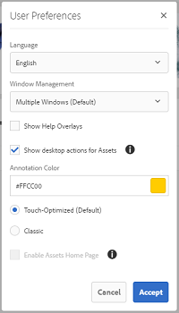

   *Bild: Välj [!UICONTROL Show Desktop Actions For Assets] för att aktivera skrivbordsåtgärder.*

## Bläddra bland, söka efter och förhandsgranska resurser {#browse-search-preview-assets}

Du kan bläddra till, söka efter och förhandsvisa de resurser som finns i [!DNL Experience Manager] -lagring, allt inifrån datorprogrammet. Prova följande i appen:

1. Bläddra till en mapp och se grundläggande information om resurserna som finns i mappen, tillsammans med små miniatyrbilder av alla resurser.

   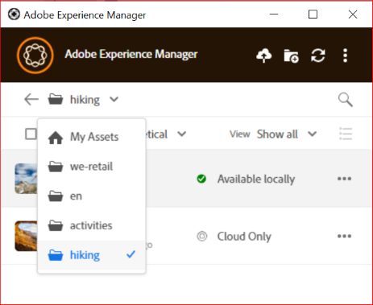

1. Om du vill visa mer information och en större miniatyrbild av en enskild resurs klickar du på filnamnet.

   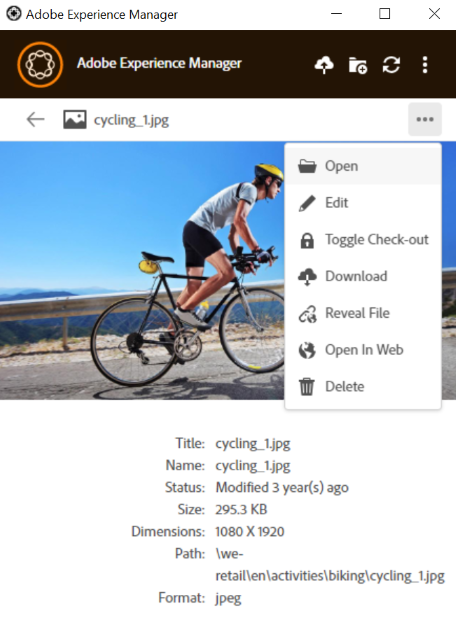

1. Klicka **[!UICONTROL Open]** eller **[!UICONTROL Edit]** om du vill hämta filen lokalt och bara visa den eller redigera den i det program där den skapades.
1. Söka med nyckelord för att hitta en relaterad resurs i [!DNL Experience Manager] databas. Använd `?` och `*` som jokertecken. Dessa jokertecken ersätter ett enda tecken eller flera tecken. Filtrera och sortera resultatet efter behov.

   

   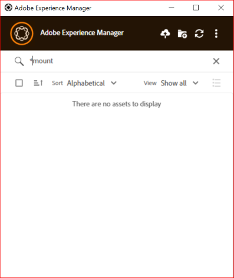

>[!NOTE]
>
>Resurserna visas i programmet genom att sökvillkoren matchas i flera metadatafält, inte bara resursens namn eller filnamn.

## Hämta resurser {#download-assets}

Du kan hämta resurserna på det lokala filsystemet. Appen hämtar resurserna från [!DNL Experience Manager] och sparar samma kopia i det lokala filsystemet.

Klicka  för alternativ och klicka  för nedladdning.

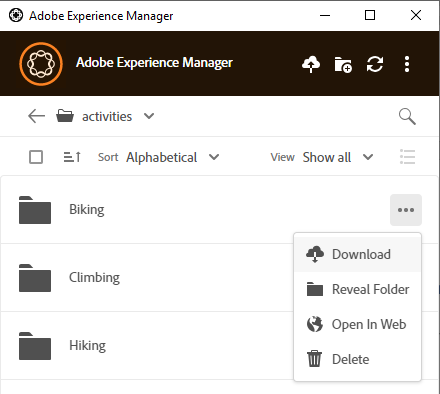

>[!NOTE]
>
>När du hämtar eller överför en stor fil eller många filer, inaktiveras åtgärderna för resurser och mappar. Åtgärderna är tillgängliga när hämtningen eller överföringen är klar.

Hämtning av flera resurser kan leda till sämre prestanda om köstorleken är stor eller om du har problem med nätverket. Du kan också ovetande köa många resurser för hämtning när du hämtar en mapp. För att undvika långa väntetider begränsar appen antalet resurser som hämtas på en gång. Mer information om hur du konfigurerar den finns i [Ange inställningar](install-upgrade.md#set-preferences). Även under denna gräns kan programmet ibland behöva be om en bekräftelse innan en till synes stor mapp laddas ned.

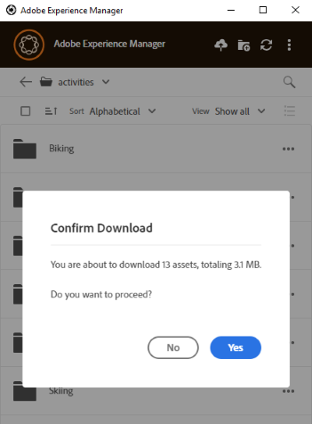

Om en eller flera mappar har valts och hämtats hämtar programmet bara resurser som lagras direkt i mappen/mapparna i [!DNL Experience Manager]. Det hämtar inte resurser från undermappar automatiskt.

## Öppna resurser på datorn {#openondesktop-v2}

Du kan öppna fjärrresurserna för visning i det ursprungliga programmet. Resurserna hämtas till en lokal mapp och startas i det program som är associerat med filformatet. Du kan ändra det inbyggda programmet så att det öppnar specifika filtyper (tillägg) i Mac eller Windows.

Klicka **[!UICONTROL Open]** på resursmenyn. Resursen hämtas lokalt och öppnas i det ursprungliga programmet. Kontrollera hämtningsförloppet och överföringshastigheten för stora resurser i statusfältet.

<!-- 
-->

>[!NOTE]
>
>Om de förväntade ändringarna inte visas i programmet klickar du på ikonen Uppdatera  eller högerklicka i appgränssnittet och klicka på **[!UICONTROL Refresh]**. Åtgärderna är inte tillgängliga medan större hämtningar eller överföringar pågår.

Om du vill öppna den lokala hämtningsmappen för en resurs klickar du på  och klicka  **[!UICONTROL Reveal File]** åtgärd.

## Använd eller placera resurser i ursprungsdokument {#place-assets-in-native-documents}

I vissa fall, till exempel när du monterar en resurs i ett internt dokument, kan du få åtkomst till en fil i Utforskaren i Windows eller Mac Finder. Använd kommandot  **[!UICONTROL Reveal File]** alternativ.

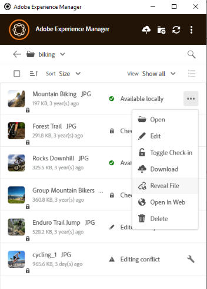

Klicka **[!UICONTROL Reveal File]**, eller **[!UICONTROL Reveal Folder]** om du vill öppna Utforskaren eller Mac Finder i en mapp med filen eller mappen förmarkerad på den lokala datorn. Alternativet är användbart för att t.ex. placera [!DNL Experience Manager] -filer i de program som stöder montering eller länkning av lokala filer. Information om hur du monterar filer i Adobe InDesign finns i [Montera bilder](https://helpx.adobe.com/indesign/using/placing-graphics.html).

The **[!UICONTROL Reveal File]** åtgärden öppnar en lokal nätverksresurs som endast visar resurser som är tillgängliga lokalt, det vill säga resurser som har visats, hämtats eller öppnats/redigerats med appen. Den lokala nätverksresursen överför inga ändringar till [!DNL Experience Manager]. Använd explicit för att överföra ändringarna **[!UICONTROL Upload Changes]** eller **[!UICONTROL Upload]** i appen.

>[!NOTE]
>
>För bakåtkompatibilitet med [!DNL Experience Manager] datorprogrammet v1.x, de filer som visas hanteras från en lokal nätverksresurs, vilket endast visar lokalt tillgängliga filer. Skrivbordssökvägarna för de visade filerna är samma som sökvägarna som skapas i programmet v1.x.

>[!CAUTION]
>
>Använd inte **[!UICONTROL Reveal File]** alternativ för att redigera resurser i ursprungsprogram. Använd i stället **[!UICONTROL Edit]** åtgärder. Mer information finns på [Avancerat arbetsflöde: samarbeta med samma filer och undvika redigeringskonflikter](#adv-workflow-collaborate-avoid-conflicts).

## Redigera resurser och överföra uppdaterade resurser till [!DNL Experience Manager] {#edit-assets-upload-updated-assets}

Öppna resurser för redigering när du vill göra ändringar och överföra de uppdaterade resurserna till AEExperience ManagerEM-servern. Om du vill undvika konflikter med redigeringar av andra användare använder du programmet för att starta en redigeringssession. Innan du börjar redigera bör du kontrollera att resursen inte har någon låsikon, det vill säga att en annan användare inte redigerar resursen.

Om du vill redigera en resurs söker du efter resursen eller bläddrar till resursens plats. Klicka  och klicka **[!UICONTROL Edit]**.

Använd **[!UICONTROL Toggle Check-out]** för att låsa resursen för att förhindra konflikter med redigeringar av andra användare i båda följande situationer:

* Du har börjat redigera en resurs utan att först checka ut den (till exempel genom att öppna den).
* Du har för avsikt att börja redigera en resurs inom kort och vill inte att andra ska kunna redigera den.

När du är klar med redigeringarna visas **[!UICONTROL Edited Locally]** status för de ändrade resurserna. Alla ändringar som har sparats i resurserna är bara lokala tills du överför ändringarna till [!DNL Experience Manager]. Om du vill överföra en enskild eller ett fåtal resurser klickar du på **[!UICONTROL Upload Changes]** från alternativen för en resurs. Den skapar en version av resursen i [!DNL Experience Manager]. Använda webbgränssnittet i [!DNL Assets]kan du se resurshistorik i [Tidslinjevy](https://experienceleague.adobe.com/docs/experience-manager-65/assets/using/activity-stream.html).

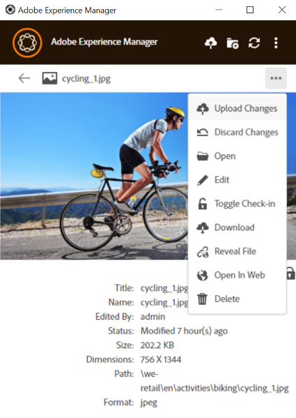

Bästa tillvägagångssätt för samverkansbaserad redigering finns i [Avancerat arbetsflöde: samarbeta med samma filer och undvika redigeringskonflikter](#adv-workflow-collaborate-avoid-conflicts).

I följande fall kanske du vill ignorera dina ändringar och redigeringar av den lokala resursen. Klicka på **[!UICONTROL Discard Changes]**.

* Om du inte vill spara dina lokala ändringar i [!DNL Experience Manager].
* Börja göra ändringar i den ursprungliga resursen när du har sparat några ändringar.
* Sluta redigera resursen eftersom den inte längre behövs.

Om det behövs kan du växla utcheckning. Den uppdaterade resursen tas bort från den lokala cachemappen och hämtas igen när du redigerar eller öppnar den.

## Överför och lägg till nya resurser till [!DNL Experience Manager] {#upload-and-add-new-assets-to-aem}

Användare kan lägga till nya resurser i DAM-databasen. Du kan till exempel vara fotograf eller entreprenör på en byrå som vill lägga till ett stort antal foton från en fotografering till [!DNL Experience Manager] databas. Lägga till nytt innehåll i [!DNL Experience Manager], markera  i appens övre fält. Bläddra till resursfilerna i det lokala filsystemet och klicka på **[!UICONTROL Select]**. Du kan också överföra resurser genom att dra filerna eller mapparna i programgränssnittet. I Windows överförs resurserna till mappen om du drar resurser till en mapp i appen. Om det tar längre tid att överföra visas en förloppsindikator.

<!-- 
-->

Du kan överföra mappar eller enskilda filer från det lokala filsystemet. En mapps hierarki bevaras när den överförs. Innan du överför resurser i grupp, se [Massöverföringar](#bulk-upload-assets).

Om du vill visa en lista över resurser som överförts under en viss session klickar du på **[!UICONTROL View]** > **[!UICONTROL Assets transfers]**. I listan kan du visa och snabbt verifiera filöverföringar för den aktuella sessionen.

Du kan styra samtidighet för överföring (acceleration) i **[!UICONTROL Preferences]** > **[!UICONTROL Upload acceleration]** inställning. Mer samtidighet ger vanligtvis snabbare överföringar, men kan vara resurskrävande och förbrukar mer processorkraft på den lokala datorn. Om du upplever ett långsamt system försöker du överföra igen med ett lägre värde av samtidighet.

>[!NOTE]
>
>Överföringslistan är inte beständig och är inte tillgänglig om du avslutar programmet och öppnar det igen.

### Hantera specialtecken i resursnamn {#special-characters-in-filename}

I det äldre programmet bevarade de nodnamn som skapades i databasen utrymmet och skiftläget för mappnamnen som användaren angett. Aktivera för att det aktuella programmet ska emulera reglerna för nodnamngivning i v1.10-appen [!UICONTROL Use legacy conventions when creating nodes for assets and folders] i [!UICONTROL Preferences]. Se [appinställningar](/help/using/install-upgrade.md#set-preferences). Den här äldre inställningen är inaktiverad som standard.

>[!NOTE]
>
>Programmet ändrar bara nodnamnen i databasen med följande namnkonventioner. Appen behåller `Title` i befintligt skick.

<!-- TBD: Do NOT use this table.

| Where do characters occur | Characters | Legacy preference | Renaming convention | Example |
|---|---|---|---|---|
| In file name extension | `.` | Enabled or disabled | Retained as is | NA |
| File or folder name | `. / : [ ] | *` | Enabled or disabled | Replaced with a `-` (hyphen) | `myimage.jpg` remains as is and `my.image.jpg` changes to `my-image.jpg`. |
| Folder name | `% ; # , + ? ^ { } "` | Disabled | Replaced with a `-` (hyphen) | tbd |
| File name | `% # ? { } &` | Disabled | Replaced with a `-` (hyphen) | tbd |
| File name | Whitespaces | Enabled or disabled | Retained as is | NA |
| Folder name | Whitespaces | Disabled | Replaced with a `-` (hyphen) | tbd |
| File name | Uppercase characters | Disabled | Retained as is | tbd |
| Folder name | Uppercase characters | Disabled | Replaced with a `-` (hyphen) | tbd |
-->

| Characters ‡ | Äldre inställning i appen | Vid förekomst i filnamn | Vid förekomst i mappnamn | Exempel |
|---|---|---|---|---|
| `. / : [ ] \| *` | Aktiverad eller inaktiverad | Ersatt med `-` (bindestreck) A `.` (punkt) i filnamnstillägget behålls som det är. | Ersatt med `-` (bindestreck) | `myimage.jpg` förblir som och `my.image.jpg` ändringar i `my-image.jpg`. |
| `% ; # , + ? ^ { } "` och blanksteg |  Handikappade | Blanksteg behålls | Ersatt med `-` (bindestreck) | `My Folder.` ändringar i `my-folder-`. |
| `# % { } ? & .` |  Handikappade | Ersatt med `-` (bindestreck) | NA. | `#My New File.` ändringar i `-My New File-`. |
| Versaler |  Handikappade | Läsningen behålls som den är. | Ändrad till gemener. | `My New Folder` ändringar i `my-new-folder`. |
| Versaler |  Aktiverad | Läsningen behålls som den är. | Läsningen behålls som den är. | NA. |

‡ Teckenlistan är en blankstegsavgränsad lista.

<!-- TBD: Check if the following is to be included in the footnote.

Do not use &#92;&#92; in the names of files and &#92;&#116; &#38; in the names of folders. 
-->

<!-- TBD: Securing the below presentation of the same content in a comment.

**File names**

| Characters | Replaced by |
|---|---|
| &#35; &#37; &#123; &#63; &#125; &#38; &#46; &#47; &#58; &#91; &#124; &#93; &#42; | hyphen (-) |
| whitespaces | whitespaces are retained |
| capital case | casing is retained |

>[!CAUTION]
>
>Avoid using &#92;&#92; in file names.

**Folder names**

| Characters | Replaced by |
|---|---|
| Characters | Replaced by |
| &#37; &#59; &#35; &#44; &#43; &#63; &#94; &#123; &#123; &#34; &#46; &#47; &#59; &#91; &#93; &#124; &#42; | hyphen (-) |
| whitespaces | hyphen (-) |
| capital case | lower case |

>[!CAUTION]
>
>Avoid using &#92;&#92; &#92;&#116; &#38; in folder names.

>[!NOTE]
>
>If you enable [!UICONTROL Use legacy conventions when creating nodes for assets and folders] in app [!UICONTROL Preferences], then the app emulates v1.10 app behavior when uploading folders. In v1.10, the node names created in the repository respect spaces and casing of the folder names provided by the user. For more information, see [app Preferences](/help/using/install-upgrade.md#set-preferences).

-->

## Arbeta med flera resurser {#work-with-multiple-assets}

Användare kan enkelt arbeta med och hantera flera resurser med åtgärder som att överföra alla redigeringar på en gång eller överföra kapslade mappar med några klick.

### Bläddra i stora mappar {#browse-large-folders}

När du arbetar med mappar som innehåller många resurser bläddrar du för att visa fler resurser. Om du vill rulla med tangentbordet trycker du på Tabb några gånger för att markera resursen längst upp. Observera den markerade resursen för att veta när den är markerad. Använd nu nedåtpilen för att förflytta dig i resurslistan.

### Snabbåtgärder för valda resurser {#quick-actions-for-selected-assets}

Klicka på miniatyrbilden för några resurser för att markera resurserna. Om du vill markera alla resurser klickar du i kryssrutan i appens övre fält. Den uppsättning åtgärder som gäller för alla markerade resurser tillsammans visas i ett verktygsfält längst ned i programmet.

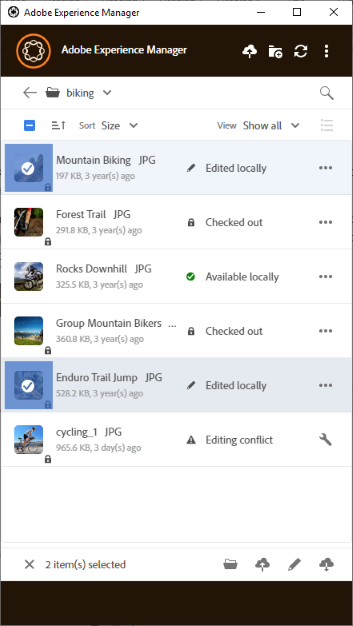

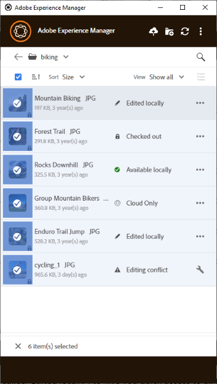

Vilka åtgärder som är tillgängliga i verktygsfältet längst ned beror på statusen för de valda filerna. Om du t.ex. bara väljer **[!UICONTROL Edited Locally]** filer, du ser **[!UICONTROL Upload Changes]** -ikon. Om du väljer en blandning av **[!UICONTROL Edited locally]** och **[!UICONTROL Cloud only]**, **[!UICONTROL Upload Changes]** åtgärden är inte tillgänglig.

### Söka efter alla redigerade bilder {#find-all-edited-images}

Programmet tillhandahåller en vy som kallas **[!UICONTROL Edited locally]**, så att du snabbt får tillgång till alla filer som du har laddat ned lokalt (via [!UICONTROL Open] eller [!UICONTROL Edit] åtgärder) och sedan ändras. Med appen kan du välja alla lokalt redigerade resurser och överföra ändringarna med några klick. I den här vyn visas även lokalt redigerade resurser som har en redigeringskonflikt.

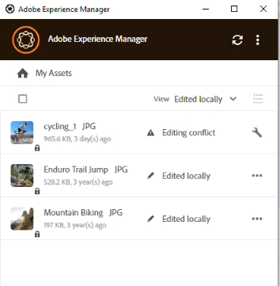

### Överför resurser gruppvis {#bulk-upload-assets}

Användare eller organisation, t.ex. fotografer eller byråer, kan skapa olika typer av resurser i olika scenarier, t.ex. foton, retuschering eller urval från en större uppsättning som gjorts utanför [!DNL Experience Manager]. De kan överföra dessa stora lokala mappar till [!DNL Assets] direkt från datorprogrammet. Mapphierarkierna bevaras och alla kapslade undermappar och inkluderade resurser överförs. De överförda resurserna är omedelbart tillgängliga för andra användare på samma server för användning. Resurser överförs i bakgrunden, så åtgärden är inte kopplad till en webbläsarsession.

![Överför flera lokala mappar från skrivbordet till [!DNL Experience Manager]](assets/upload_local_folders_da2.png "Ladda upp flera lokala mappar från skrivbordet i Experience Manager gruppvis")

Om de förväntade ändringarna inte visas i programmet klickar du på uppdateringsikonen när du har överfört dem .

>[!NOTE]
>
>Använd inte överföringsfunktionalitet för att migrera resurser över två [!DNL Experience Manager] distributioner. I stället kan du se [migreringsguide](https://experienceleague.adobe.com/docs/experience-manager-65/assets/administer/assets-migration-guide.html).

### Lista över överförda tillgångar {#list-of-transferred-assets}

Om du vill visa en lista över resurser som överförts under en viss session går du till [Överför resurser till [!DNL Experience Manager]](#upload-and-add-new-assets-to-aem).

## Avancerat arbetsflöde: börja från [!DNL Assets] webbgränssnitt {#adv-workflow-start-from-aem-ui}

Om det behövs startar du arbetsflödet från webbgränssnittet Resurser. Datorprogrammet är integrerat med [!DNL Experience Manager] för att ta över när det efterfrågas med Skrivbordsåtgärder.

Ett särskilt exempel på hur du startar arbetsflödet från webbgränssnittet är tillgångsidentifiering. Omnissearch bar in Assets-användargränssnittet ger en omfattande och avancerad sökfunktion. Du kanske först vill hitta en önskad resurs på webben och sedan starta arbetsflödet i programmet med hjälp av [!UICONTROL Desktop Actions]. I vissa exempelfall kan du filtrera sökresultat med hjälp av ansikten, hitta en specifik resurs som licensierats från Adobe Stock eller anpassa den som implementerats av din organisation så att du kan identifiera den bättre i webbgränssnittet.

Funktionen för skrivbordsprogram används när du försöker utföra följande åtgärder i webbgränssnittet Resurser:

* The [!UICONTROL Desktop Actions] som tillåter [!UICONTROL Open], [!UICONTROL Edit]och [!UICONTROL Reveal]
* [!UICONTROL Upload folder]
* [!UICONTROL Check-out] eller [!UICONTROL check-in]

De åtgärder på webbgränssnittet som är tillgängliga för en resurs som är utcheckad i programmet är till exempel [!UICONTROL Open], [!UICONTROL Reveal]och [!UICONTROL Check-in].

![Skrivbordsåtgärder i [!DNL Experience Manager] webbgränssnitt](assets/assets_web_actions_da2.png "Skrivbordsåtgärder i webbgränssnittet i Experience Manager")

>[!NOTE]
>
>Webbläsaren kan uppmana dig att tillåta att [!DNL Adobe Experience Manager] Skrivbord. Om du vill att appen ska kunna överföras utan avbrott från webbläsaren till appen markerar du kryssrutan så att appen alltid kan ta över.

Du kan inte hitta följande information eller arbetsflöde med webbgränssnittet. Använd skrivbordsappen eftersom webbgränssnittet inte kan spåra lokala ändringar och inte känner till följande:

* Filer redigerade lokalt.
* Filer som har en redigeringskonflikt och ett sätt att lösa den.
* Överför lokala ändringar till [!DNL Experience Manager].
* Olika statusvärden för de lokalt tillgängliga filerna.

Du kan tvärtom öppna resursen i webbgränssnittet från skrivbordsappen med hjälp av **[!UICONTROL Open In Web]** åtgärd.

## Avancerat arbetsflöde: samarbeta med samma filer och undvika redigeringskonflikter {#adv-workflow-collaborate-avoid-conflicts}

I samarbetsmiljöer kan flera användare arbeta med samma uppsättning resurser, vilket kan leda till versionskonflikter. Följ dessa metodtips för att förhindra konflikter:

* Redigera inga resurser genom att klicka på [!UICONTROL Open]. Redigera inte lokalt hämtade resurser genom att öppna dem från filsystemmappen. Andra användare vet inte om resursen redigeras.
* Redigera en resurs genom att alltid klicka [!UICONTROL Edit]. Resursen öppnas i det ursprungliga programmet och en låsikon läggs till på resursen, så att de andra användarna vet att resursen redigeras.
* Klicka [!UICONTROL Toggle Check-in] om du av misstag börjar redigera utan att klicka [!UICONTROL Edit]. Då läggs en låsikon till i resursen. Även om du planerar att redigera en resurs senare men vill undvika att andra redigerar den klickar du på [!UICONTROL Toggle Check-in] för att låsa resursen.
* Innan du redigerar en resurs måste du se till att andra användare inte redigerar den. Leta efter låsikonen på resursen.
* När du är klar med redigeringarna överför du alla ändringar och checkar sedan in resursen.

Om en lokalt nedladdad resurs uppdateras på [!DNL Experience Manager] -server, programmet visar en **[!UICONTROL Modified remotely]** status. Du kan antingen ta bort din lokala kopia eller uppdatera din lokala kopia genom att klicka på [!UICONTROL Remove] eller [!UICONTROL Update] respektive. Med länkar i dialogrutan kan du visa båda versionerna av resursen.

Om en resurs som du redigerar lokalt även uppdateras på servern utan din vetskap, visas en **[!UICONTROL Editing Conflict]** status. Du kan behålla en uppsättning ändringar - antingen behålla dina uppdateringar (klicka på **[!UICONTROL Keep Mine]**) och ta bort den andra användarens redigering eller ta hänsyn till den andra användarens uppdateringar och ta bort din (**[!UICONTROL Overwrite Mine]**).

## Avancerat arbetsflöde: placera och länka resurser i InDesign-filen {#adv-workflow-place-assets-indesign}

När du använder [!DNL Experience Manager] om du vill öppna filer med länkade resurser i ett datorprogram hämtas resurserna i förväg och visas i de ursprungliga programmen. För att det här arbetsflödet ska fungera måste ditt program ha stöd för att placera länkar till lokala resurser och [!DNL Experience Manager] måste ha stöd för att lösa länkarna i de binära filerna till serversidans referenser.

[!DNL Experience Manager] skrivbordsappen har stöd för det här arbetsflödet med några utvalda Adobe Creative Cloud-program och -filformat - Adobe InDesign, Adobe Illustrator och Adobe Photoshop. Med arbetsflödet kan du arbeta effektivt med de Creative Cloud-filer som stöds. Så om användare A placerar ut ett fåtal resurser i en InDesign-fil och checkar in den i [!DNL Experience Manager]ser användare B resurserna i InDesignen trots att resurserna inte är en del av filen. Resurserna hämtas lokalt till dator med användare B.

>[!NOTE]
>
>Skrivbordsappen kan mappas till valfri enhet i Windows. För mjuka åtgärder ska du dock inte ändra standardenhetsbokstaven. Om användare i samma organisation använder olika enhetsbokstäver kan de inte se resurser som placerats av andra. De placerade resurserna hämtas inte när sökvägen ändras. De placerade resurserna fortsätter att vara placerade i den binära filen (till exempel INDD) och tas inte bort.

Om du vill veta mer om begränsningarna i det här arbetsflödet kan du läsa [systemkrav och versioner som stöds](release-notes.md).

Så här provar du arbetsflödet med en bildresurs och InDesign:

1. Håll en INDD-fil praktisk med monterade resurser i [!DNL Experience Manager]. Mer information om hur du skapar en sådan INDD-fil finns i [Placera grafik](https://helpx.adobe.com/indesign/using/placing-graphics.html).
1. I datorprogrammet **[!UICONTROL Edit]** INDD-filen med monterade resurser i [!DNL Experience Manager].
1. Programmet hämtar både InDesignen och de länkade resurserna. När InDesignen öppnar dokumentet är länkarna lösta, resurserna hämtas och resurserna visas i InDesignen.
1. Om du vill montera en ny InDesign i bildfilen använder du **[!UICONTROL Reveal File]** åtgärd för tillgången. Åtgärden hämtar resursen lokalt och öppnar den lokala nätverksresursplatsen i Utforskaren eller Mac Finder.
1. Placera den visade resursen i InDesignen. Då skapas en länk i dokumentet.
1. När du är klar med redigeringen i InDesignen sparar du den och överför den till [!DNL Experience Manager] med datorprogrammet.

## Avancerat arbetsflöde: hämta resurser lokalt {#adv-workflow-download-assets-locally}

Appen hämtar resurserna från [!DNL Experience Manager] server lokalt i filsystemet i många scenarier. Nedladdningarna förbrukar bandbredd och diskutrymme. Genom att känna till scenarierna kan du optimera väntetiden för nedladdningen.

Du hämtar resurserna inifrån appen on-demand. Se [Hämta resurser](#download-assets).

När du använder [!UICONTROL Open] åtgärd för att öppna en resurs i ett datorprogram hämtas resursen lokalt om den inte redan är tillgänglig lokalt. Se [Öppna resurser](#openondesktop-v2).

När du visar platsen för en resurs eller en mapp inifrån programmet hämtas resursen eller mappen först lokalt och öppnas sedan på datorn i den lokala nätverksresursen. Se [Öppna resurser](#openondesktop-v2).

När du använder [!UICONTROL Edit] åtgärd för att redigera en resurs i ett datorprogram hämtas resursen lokalt om den inte redan är tillgänglig lokalt. Se [Redigera resurser och överföra uppdaterade resurser till [!DNL Experience Manager]](#edit-assets-upload-updated-assets).

Om appen är installerad och tillåts att göra det, slutförs åtgärderna när du använder [!UICONTROL Desktop Actions] från [!DNL Experience Manager] webbgränssnitt. Programmet hämtar resursen först och slutför sedan åtgärden.
